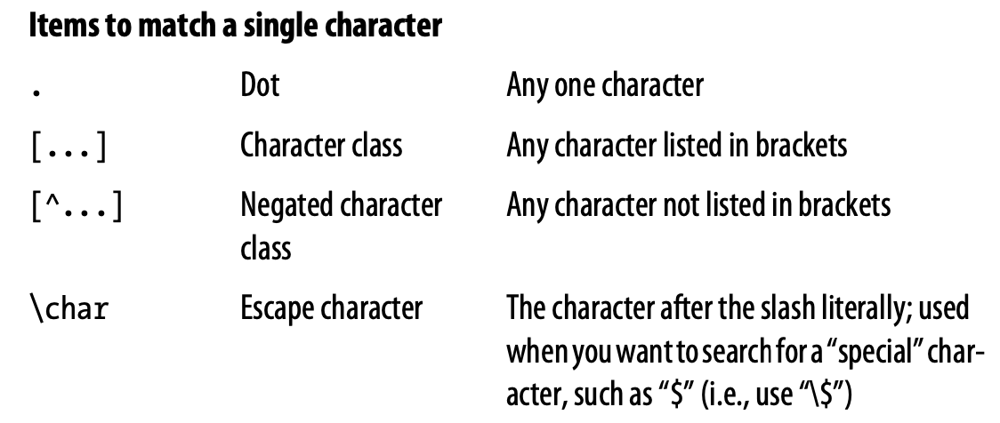
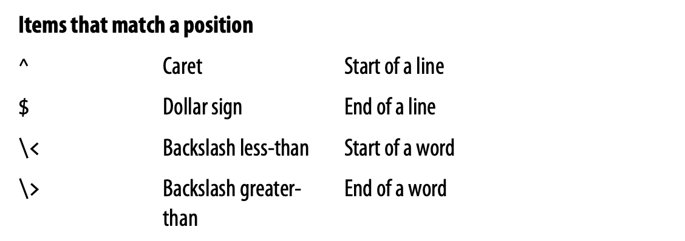
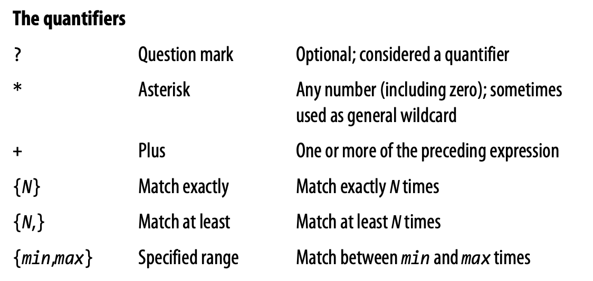
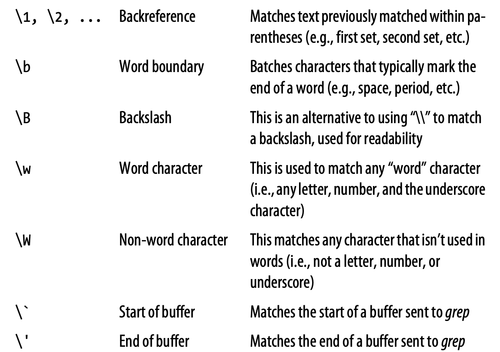

# GREP

The **grep** command provides a variety of ways to find strings of text in a file or stream of output. 

Although it is usually possible to integrate grep into manipulating text or doing “search and replace” operations, it is not the most efficient way to get the job done. Instead, the **sed** and **awk** programs are more useful for these kinds of functions.

There are two basic ways to search with grep: **searching for fixed strings** and **searching for patterns of text**.

~~~
grep [options] [regexp] [filename]
~~~ 

Regular expressions are comprised of two types of characters: **normal text characters**, called literals, and **special characters**, such as the asterisk (*), called metacharacters.

Using the backtick tells the shell to execute everything inside those quotes as a command and then use that as the string. For instance:

~~~
grep `whoami` filename
~~~

Double quotes, however, work the same as the single quotes, but with one important difference. **With double quotes, it becomes possible to use environment variables** as part of a search pattern:
grep "$HOME" filename

## Metacharacters

### Items to match a single character

### Items that match  position

### The quantifiers

### Other

