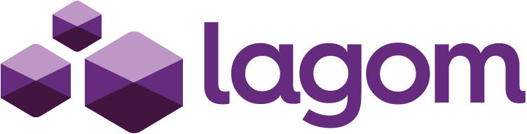

# Lagom

The **Lagom** framework builds on top of a few existing technologies and utilizes the *"convention over configuration"* approach to reduce the burden of these repetitive mechanical tasks and to deliver some additional functionality specific to the microservice systems. It does so by providing a kind of *"template"* for projects.

The preconfigured features include the following:

* Use of event sourcing as a mechanism for distributed persistence. The **recommended database is Apache Cassandra** because of its exceptional scalability and natural support for the read side of the CQRS principle.

* Support for asynchronous communications by making use of **reactive streams with Akka Streams** as an implementation and message-passing style with Apache Kafka as a broker.

* Transparent support for different communication protocols, which allows you to abstract complex API calls behind simple method calls.

* Expressive-service-description DSL, which **allows you to define APIs in a flexible and concise way.**
Dynamic scalability with Akka Cluster.

* A choice of dependency injection frameworks to wire the application at compile or runtime.

* Development mode with **hot code reload** and an ability to start all services and required infrastructure components, including a special development service registry and a service gateway with a single command.

* Default configuration for the infrastructure and preconfigured logging.

Example: [Bakery exercise on github with lagom](https://github.com/PacktPublishing/Learn-Scala-Programming/tree/master/Chapter15)

## Service interface

The service interface inherits from Service and provides an implementation of **Service.descriptor** method.

The implementation of Service.descriptor returns a Descriptor. The HelloService descriptor defines the **service name** and the **REST endpoints** it offers.

For each endpoint, declare an abstract method in the service interface as illustrated in the HelloService.hello method. For more information, see Service Descriptors.

## Service descriptors

Lagom services are described by an interface, known as a service descriptor. **This interface not only defines how the service is invoked and implemented, it also defines the metadata that describes how the interface is mapped down onto an underlying transport protocol.** *Generally, the service descriptor, its implementation and consumption should remain agnostic* to what transport is being used, whether that’s REST, websockets, or some other transport.

~~~
import com.lightbend.lagom.scaladsl.api._

trait HelloService extends Service {
  def sayHello: ServiceCall[String, String]

  override def descriptor = {
    import Service._
    named("hello").withCalls(
      call(sayHello)
    )
  }
}
~~~

An important thing to note here is that **invoking the sayHello method does not actually invoke the call**, it simply gets a handle to the call, which can then be invoked using the **invoke** method.

**ServiceCall** takes two type parameters, **Request** and **Response**. The Request parameter is the type of the incoming request message, and the Response parameter is the type of the outgoing response message.

### Call identifiers

Each service call needs to have an **identifier**. An identifier is used to provide routing information to the implementation of the client and the service, so that calls over the wire can be mapped to the appropriate call. *Identifiers can be a static name or path, or they can have dynamic components*, where dynamic path parameters are extracted from the path and passed to the service call methods.

* **call** (by default the same name than the method)

* **namedCall** (custom name with string)

~~~
named("hello").withCalls(
  namedCall("hello", sayHello)
)
~~~

* **pathCall** (This uses a URI path and query string to route calls)

~~~
def getItem(orderId: Long, itemId: String): ServiceCall[NotUsed, Item]

override def descriptor = {
  import Service._
  named("orders").withCalls(
    pathCall("/order/:orderId/item/:itemId", getItem _)
  )
}
~~~

&nbsp;&nbsp;&nbsp;&nbsp;**Dynamic path parameters** are extracted from the path by declaring dynamic parts in the path. These are prefixed with a colon, for example, a path of **/order/:id** has a dynamic part called id. Lagom will extract this parameter from the path, and pass it to the service call method.

&nbsp;&nbsp;&nbsp;&nbsp;**Query string parameters** can also be extracted from the path, using a **&** separated list after a **?** at the end of the path.

### Rest identifiers

The final type of identifier is a REST identifier. REST identifiers are designed to be used when creating semantic REST APIs. They use both a path, as with the path based identifier, and a request method, to identify them.

~~~
def addItem(orderId: Long): ServiceCall[Item, NotUsed]
def getItem(orderId: Long, itemId: String): ServiceCall[NotUsed, Item]
def deleteItem(orderId: Long, itemId: String): ServiceCall[NotUsed, NotUsed]

def descriptor = {
  import Service._
  import com.lightbend.lagom.scaladsl.api.transport.Method
  named("orders").withCalls(
    restCall(Method.POST, "/order/:orderId/item", addItem _),
    restCall(Method.GET, "/order/:orderId/item/:itemId", getItem _),
    restCall(Method.DELETE, "/order/:orderId/item/:itemId", deleteItem _)
  )
}
~~~

### Messages

Every service call in Lagom has a request message type and a response message type. When the request or response message isn’t used, the **akka.NotUsed** can be used in their place. Request and response message types fall into two categories, strict and streamed.

1. **Strict messages**

A strict message is a single message that can be represented by a simple Scala object, typically a case class. The message will be buffered into memory, and then parsed, for example, as JSON. **When both message types are strict, the call is said to be a synchronous call**, that is, a request is sent and received, then a response is sent and received. The caller and callee have synchronized in their communication.

2. **Streamed messages**

A streamed message is a message of type **Source**. Source is an Akka streams API that allows **asynchronous** streaming and handling of messages. 

~~~
import akka.NotUsed
import akka.stream.scaladsl.Source

def sayHello: ServiceCall[Source[String, NotUsed], Source[String, NotUsed]]

def descriptor = {
  import Service._
  named("hello").withCalls(
    call(this.sayHello)
  )
}
~~~

Lagom will choose an appropriate transport for the stream, typically, this will be **WebSockets**. The WebSocket protocol supports bidirectional streaming, so is a good general purpose option for streaming. *When only one of the request or response message is streamed*, Lagom will implement the sending and receiving of the strict message by sending or receiving a single message, and then leaving the WebSocket open until the other direction closes. Otherwise, Lagom will close the WebSocket when either direction closes.

#### Message serialization

Message serializers for requests and responses are provided using type classes. Each of the call, namedCall, pathCall and restCall methods take an implicit MessageSerializer for each of the request and response messages. **Out of the box Lagom provides a serializer for String messages, as well as serializers that implicitly convert a Play JSON Format type class to a message serializer**.

* Using Play json

~~~
case class User(
    id: Long,
    name: String,
    email: Option[String]
)

object User {
  import play.api.libs.json._
  implicit val format: Format[User] = Json.format[User]
}
~~~

This will generate somthing like this:

~~~
{
  "id": 12345,
  "name": "John Smith",
  "email": "john.smith@example.org"
}
~~~

## Implementing services

Services are implemented by providing an implementation of the service descriptor trait, implementing each call specified by that descriptor.

~~~
import com.lightbend.lagom.scaladsl.api.ServiceCall
import scala.concurrent.Future

class HelloServiceImpl extends HelloService {
  override def sayHello = ServiceCall { name =>
    Future.successful(s"Hello $name!")
  }
}
~~~

## Dependency injection in lagom

Lagom’s Scala API is built on top of **Play Framework**, and uses Play’s compile time dependency injection support to wire together a Lagom application. Play’s compile time dependency injection support is based on the thin cake pattern.

Once you are creating your Application you will use Components provided by Lagom and obtain your dependencies from them (e.g., an Akka Actor System or a CassandraSession for your read-side processor to access the database). Although it’s not strictly necessary, **we recommend that you use Macwire to assist in wiring dependencies into your code**. Macwire provides some very lightweight macros that locate dependencies for the components you wish to create so that you don’t have to manually wire them together yourself. Macwire can be added to your service by adding the following to your service implementations dependencies:

~~~
libraryDependencies += "com.softwaremill.macwire" %% "macros" % "2.2.5" % "provided"
~~~

The simplest way to build the Application cake and then wire your code inside it is by creating an abstract class that extends LagomApplication:

~~~
import com.lightbend.lagom.scaladsl.server._
import play.api.libs.ws.ahc.AhcWSComponents
import com.softwaremill.macwire._

abstract class HelloApplication(context: LagomApplicationContext)
    extends LagomApplication(context)
    with AhcWSComponents {
  override lazy val lagomServer = serverFor[HelloService](wire[HelloServiceImpl])
}
~~~

In this sample, the HelloApplication gets AhcWSComponents **mixed in** using the cake pattern and implements the lazy val **lagomService** using **Macwire**. The important method here is the lagomServer method. *Lagom will use this to discover your service bindings and create a Play router for handling your service calls*. You can see that we’ve bound one service descriptor, the HelloService, to our HelloServiceImpl implementation. The name of the Service Descriptor you bind will be used as the Service name, that is used in cross-service communication to identify the client making a request.

We’ve used **Macwire’s wire macro** to wire the dependencies into HelloServiceImpl - at the moment our service actually has no dependencies so we could just construct it manually ourselves, but it’s not likely that a real service implementation would have no dependencies.

The HelloApplication is an abstract class, the reason for this is that there is still one method that hasn’t been implemented, the serviceLocator method. 

The HelloApplication extends LagomApplication which needs a **serviceLocator: ServiceLocator**, a **lagomServer: LagomServer** and a **wcClient: WSClient**.

We provide the wcClient: WSClient mixing in AhcWSComponents and we provide lagomServer: LagomServer programmatically.

A typical application will use different service locators in different environments, in development, *it will use the service locator provided by the Lagom development environment, while in production it will use whatever is appropriate for your production environment, such as the service locator implementation provided by Akka Discovery Service Locator*. So our main application cake leaves this method abstract so that it can mix in the right one depending on which mode it is in when the application gets loaded.

Having created our application cake, we can now write an application loader. **Play’s mechanism for loading an application is for the application to provide an application loader**. Play will pass some context information to this loader, such as a classloader, the running mode, and any extra configuration, so that the application can bootstrap itself. Lagom provides a convenient mechanism for implementing this, the **LagomApplicationLoader**:

~~~
import com.lightbend.lagom.scaladsl.server._
import com.lightbend.lagom.scaladsl.api.ServiceLocator
import com.lightbend.lagom.scaladsl.devmode.LagomDevModeComponents

class HelloApplicationLoader extends LagomApplicationLoader {
  override def loadDevMode(context: LagomApplicationContext) =
    new HelloApplication(context) with LagomDevModeComponents

  override def load(context: LagomApplicationContext) =
    new HelloApplication(context) {
      override def serviceLocator = ServiceLocator.NoServiceLocator
    }

  override def describeService = Some(readDescriptor[HelloService])
}
~~~

Finally, we need to tell Play about our application loader. We can do that by adding the following configuration to application.conf:

~~~
play.application.loader = com.example.HelloApplicationLoader
~~~

## Service API

In order to define our *Cook as a service* we need to implement a **special interface** called a **service descriptor**. The service descriptor defines two aspects of a Lagom service:

1. **The service signature**: How the service should be called and its return type

2. **The service meta data**: How the service call is mapped to the transport layer, for example to the REST call

The **request** and **response** types in Lagom can be **strict** or **streamed**. There are four possible combinations ranging from both sides being strict to both sides being streamed. 

- **Strict** means that the request or response is fully buffered in the memory at the method boundary. The combination of **both the strict request and response results in the synchronous** semantics of the call. 

- A **streamed** request or response is of the **Source type**, which is known to us from Chapter 13, Basics of Akka Streams where we looked at Akka streams. For the streaming calls, Lagom will try its best to choose the appropriate semantics. *Typically, this will be WebSockets*, and we will see how it works later in this chapter.

It is safe to put the port number into the code listing (check logs) for reference because despite their random appearance, *ports are assigned to the services by Lagom in a deterministic manner* (basically by using a hash of a project name). Hence, the services are assigned the same port numbers (with respect to port conflicts) in any environment.

## Persistence API

### Flyway

Flyway provides a mechanism to define and change database schema in well-defined steps by adhering to specific naming conventions while placing  schema migrations SQL in the project folder. You can learn more about it at [flywaydb.org](https://flywaydb.org).

# MISCELANEA

The Lagom's recommended serialization format is JSON so we're utilizing the same approach we already used for the shared model definition.

Another deviation is the definition of manager-impl. The Manager will communicate with each of the other services, so it needs to know the API definitions of other workers. We also created a folder for each of the defined microservices in the filesystem. 

In order to simplify our example a bit, we will violate the rule that each microservice should own the definition of its model. We'll define a module containing definitions of all of the case classes used by the services we're going to build. We will add this module as a dependency to every other module we've defined before.

### Macwire

[Macwire](https://github.com/adamw/macwire) is a **dependency injection framework** that implements constructor-based DI. It does so by generating calls to the class constructors with appropriate parameters found in scope. In a sense, it provides proper constructor calls behind the scenes the same way Circe or Play provide proper mapping to JSON structures. It would be very useful in projects of significant size.

